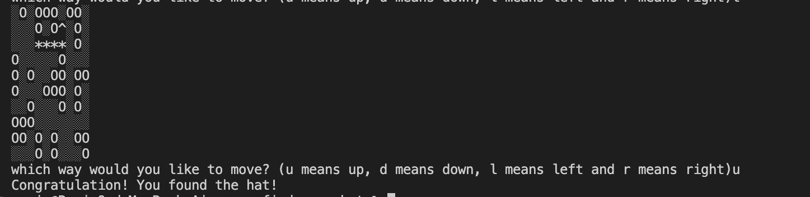

# game-find-your-hat

## Description

This is a practice challange from [Codecademy.com](https://www.codecademy.com/projects/practice/find-your-hat). It is a terminal game, a user(represented by *) needs to find the hat(represented by ^) while avoiding falling in holes(represented by O). 

## Table of Contents
- [Installation](#installation)
- [Usage](#usage)

## Installation

git clone the repository, then run `npm install` 

## Usage

* When the game starts, the player is starting from a random location
* Press 'u' to move the player's path up; press 'd' the path will move down; press 'l' the path moves left; press 'r' the path moves right.
* When the player is outside of the field boundary, fell in a hole, the game ends, the player loses.
* When the player finds the hat, the game ends, the player wins.

Here's a screenshot of the project

